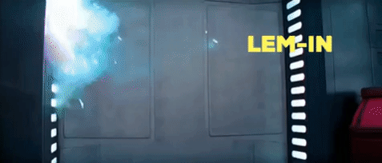

<div style="text-align:center">
  
</div>

<h1 style="text-align: center;" markdown="1">Lem-in</h1>

*****

## DISCLAIMER

Jupyter Notebook was mainly used for **visualization** purposes as a side objective. The core language used is in C.

## In World Practice Inspiration

[Slime Mold Networks Just Like Tokyo Rail System](https://www.wired.com/2010/01/slime-mold-grows-network-just-like-tokyo-rail-system/)

## Building

`make && pip3 install -r requirements.txt`

`./lem_in [-p] [-c] < maps/your_choice_of_map`

> **-p** Lists of used paths that the ants are being sent.
>
> **-c** Count the total of turns it took the total traversal of the map from source to exit.

## Running the program
After selecting the map of your choice from the `maps` folder, you will see different files with bunch of things happening.

To understand what is it doing, I will describe each part of the map file that is being used:

`~/small/ex.map`

```
3		     <- Number of ants placed
2 5 0	   <- Creating a new room
##start  <- Command call of the start room
0 1 2	   <- Start room of all ants first placed
##end    <- Command call of the end room
1 9 2	   <- Exit room of all ants in the end
3 5 4	   <- Creating a new room
0-2	     <- Room name 0 creating a path to room name 2
0-3	     <- Room name 0 creating a path to room name 3
2-1	     <- Room name 2 creating a path to room name 1
3-1	     <- Room name 3 creating a path to room name 1
2-3	     <- Room name 2 creating a path to room name 3
```

The first line of the file will be **ALWAYS** the total number of ants in place. After that, you can start creating more rooms. In order to create a new room, the structure must be `[room string name] [position x] [position y]`. For example, `2 5 0` is a room with a name `2` located in `5` and `0`. Once the rooms are created (including the start and end), we can link to each room to create a path for our ants such as `0-2`, `0-3`, etc...

## Demo

<div style="text-align:center">
  
</div>

And for the big map from the `visual/ex.txt` example:

<div style="text-align:center">
  
</div>
